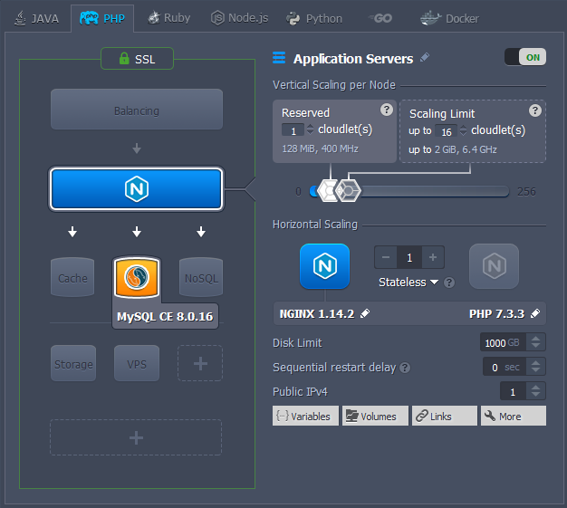

# WordPress 1 Click Deployment
This package deploys an High Available WordPress hosting solution that contains 1 application server and 1 database container. The package provides vertical scaling per node, and adds Free SSL Certificate to your environment.

## Highlights
This package is designed to handle big load spikes by adjusting the allocated resources and topology configuration with a help of vertical and horizontal scaling. As result, it provides very cost effective solution for websites and blogs with variable load.

## Environment Topology

## Specifics

Layer                    |         Server        | Number of CTs   by default | Cloudlets per CT   (reserved/dynamic) | Options
------------------------ | :-------------------: | :----------------------------: | :---------------------------------------: | :-----:
AS                       |    NGINX PHP FPM      |               1                |                 1 / 8                     | -
DB                       |        MySQL          |               1                |                 4 / 8                     | -

* AS - Application server
* DB - Database
* CT - Container

**WordPress Version**: WordPress Latest 
**PHP Engine**: PHP 7.3.3 
**MySQL Database**: 8.0.16

### Deployment

Take advantage of our 14 Day Free Trial and get this solution deployed instantly, click the "Deploy to WebWolf Hosting" button, specify your email address within the widget, name your environment, choose a location and press Install.

To deploy this package to WebWolf PaaS, import [this manifest](https://github.com/mommaroodles/wordpress/blob/master/manifest.jps) within your dashboard.
After installation, to add an Custom Domain, add an external IP to your application server and create an A record with your domain name pointing to your external IP, OR, add a CNAME record pointing to our environment URL.

**For More Information** visit [WebWolf Hosting](https://webwolfhosting.com/pricing-and-payment/)

